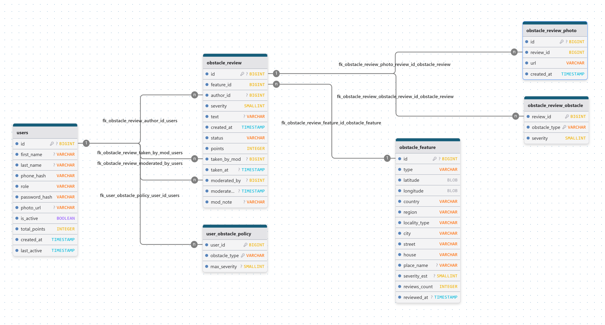

<p align="center">
  
</p>

## GoodRoad (Server)

**Авторы**: ```Городкова Ксения```, ```Грудцына Виктория```, ```Толстограева Виктория```

## Краткое описание проекта

**GoodRoad** — мобильное приложение для построения пеших инклюзивных маршрутов с учетом состояния дороги, препятствий на пути и персональных ограничений пользователя.

Обычный навигатор часто показывает только самый короткий или быстрый путь, но не объясняет, насколько этот путь удобен на практике. На маршруте могут встретиться лестницы, высокие бордюры, ямы, крутые участки дороги и другие барьеры. GoodRoad решает именно эту задачу: приложение помогает заранее понять, подходит ли путь конкретному человеку, показывает проблемные места и позволяет собирать отзывы о доступности дорог и объектов.

Сейчас проект представлен в формате MVP. В этой версии представлена основная серверная логика: аутентификация, работа с профилем, настройка пользовательской политики препятствий, отзывы о доступности, модерация контента и контейнерный запуск проекта.

## Технологии сервера

| Категория | Технологии | Назначение |
|---|---|---|
| Язык | Java 17 | Основной язык backend-части |
| Backend framework | Spring Boot 3 | Конфигурация приложения и REST API |
| Web | Spring Web | Обработка HTTP-запросов и JSON-ответов |
| Безопасность | Spring Security | Аутентификация и разграничение доступа |
| Валидация | Spring Validation | Проверка входящих данных |
| Работа с БД | Spring Data JPA, Hibernate | Работа с сущностями и репозиториями |
| База данных | PostgreSQL | Основное серверное хранилище |
| Геоданные | PostGIS | Хранение и обработка пространственных данных |
| Утилиты | Lombok | Упрощение шаблонного Java-кода |
| Сборка | Gradle | Сборка проекта и управление зависимостями |
| Контейнеризация | Docker, Docker Compose | Локальный деплой сервера и БД |
| Тестирование API | Postman | Проверка REST API без клиента |

---

## Архитектура сервера

Сервер реализован по следующей схеме:

**Controller → Service → Repository → Database**

- **Controller Layer** принимает запросы от Android-клиента и возвращает HTTP/JSON-ответ;
- **Service Layer** содержит основную бизнес-логику;
- **Repository Layer** работает с PostgreSQL через JPA;
- **Database Layer** хранит пользователей, препятствия, пользовательские настройки, отзывы, фотографии и результаты модерации.

### Основные backend-модули

| Модуль | Назначение |
|---|---|
| `auth` | Регистрация, вход, восстановление пароля |
| `users` | Профиль пользователя, смена пароля, аватар, удаление аккаунта |
| `users/moderators` | Управление модераторами |
| `obstacle` | Препятствия и политика избегаемых препятствий |
| `reviews` | Отзывы и модерация |
| `security` | Конфигурация безопасности |
| `bootstrap` | Стартовая инициализация администратора и фоновые задачи |

### Слои серверной архитектуры

| Слой | Что включает | Назначение |
|---|---|---|
| Controller | `AuthController`, `UserController`, `ModeratorController`, `ObstacleController`, `UserObstaclePolicyController`, `UserReviewController`, `ReviewModerationController` | Прием REST-запросов и возврат ответов |
| Service | `AuthService`, `UserSettingsService`, `ModeratorService`, `ObstacleDBService`, `UserObstaclePolicyService`, `UserReviewService`, `ReviewModerationService`, `ReviewSupportService` | Бизнес-логика приложения |
| Repository | Репозитории пользователей, препятствий, отзывов, фотографий и политик пользователя | Работа с данными через JPA |
| Infrastructure | `SecurityConfig`, `Crypto`, `AdminBootstrap`, `UserCleanupJob`, `ApiErrors` | Безопасность, служебные задачи, обработка ошибок |

---

## Деплой

На текущем этапе MVP сервер разворачивается локально через Docker Compose. Сценарий запуска:
1. Поднимается контейнер `db` с PostgreSQL/PostGIS;
2. Backend собирается через `Dockerfile.server`;
3. апускается контейнер `server`;
4. Приложение подключается к БД по внутреннему имени сервиса `db`.

## Безопасность

- Использование **Spring Security** для защиты приватных endpoint;
- **HTTP Basic Auth** для доступа к защищенным маршрутам;
- Разграничение прав по ролям;
- Хеширование паролей через **BCrypt**;
- Нормализация номера телефона перед обработкой;
- Хранение телефона в БД в виде **SHA-256 hash**;
- Централизованная обработка ошибок через единый API error handler;
- Ограничения на загрузку аватаров:
    - Только `image/jpeg`, `image/png`, `image/webp`;
    - Размер не более 5 МБ;
- Автоматическое создание учетной записи главного модератора при старте приложения;
- Фоновая очистка давно неактивных аккаунтов по расписанию.

## Структура проекта

### Структура серверного репозитория

```text
GoodRoad-Server/
├── src/
│   └── main/
│       ├── java/goodroad/
│       │   ├── api/
│       │   ├── auth/
│       │   ├── bootstrap/
│       │   ├── model/
│       │   ├── obstacle/
│       │   ├── reviews/
│       │   ├── security/
│       │   └── users/
│       └── resources/
│           ├── application.yml
│           └── schema.sql
├── Dockerfile.server
├── docker-compose.yml
├── build.gradle
├── GoodRoad-tests.json
└── SETUP.md
```
### Схема взаимодействия объектов в базе данных
<p align="center">
  
</p>