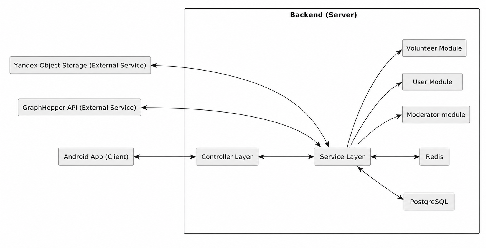
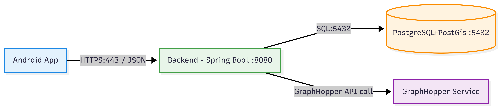
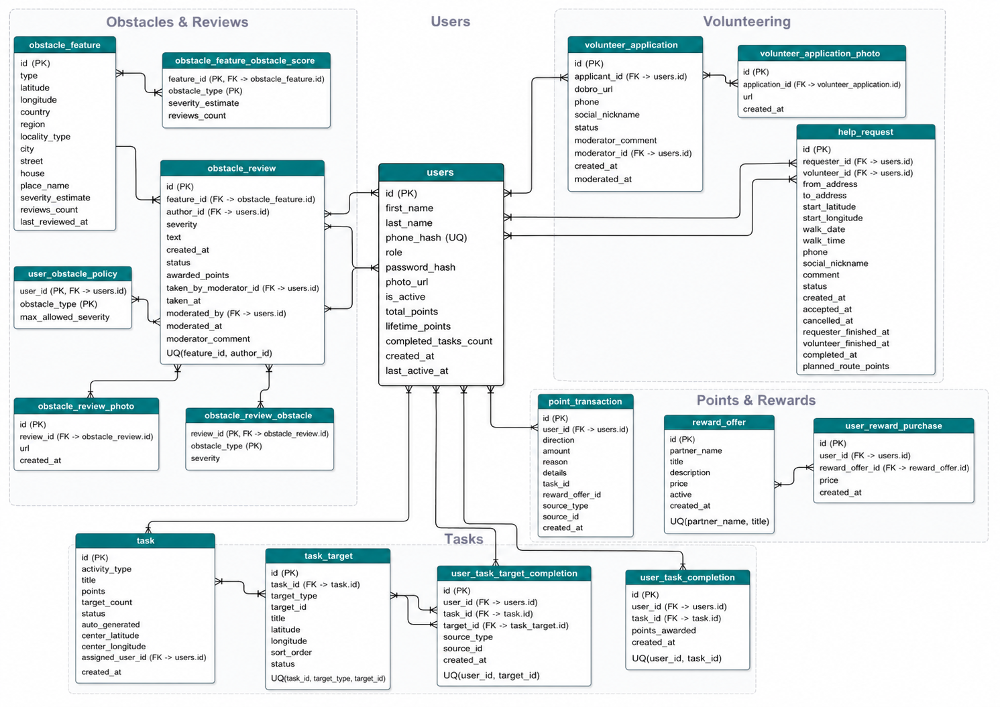
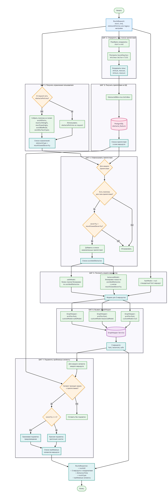

<p align="center">
  
</p>

## GoodRoad (Server)

**Авторы**: ```Городкова Ксения```, ```Грудцына Виктория```, ```Толстограева Виктория```

## Краткое описание проекта

**GoodRoad** — мобильное приложение для построения пеших инклюзивных маршрутов с учетом состояния дороги, препятствий на пути и персональных ограничений пользователя.

Обычный навигатор зачастую показывает только самый короткий или быстрый путь, но не объясняет, насколько он удобен на практике. Вместе с тем на маршруте могут встретиться лестницы, высокие бордюры, крутые участки дороги и другие барьеры. GoodRoad решает именно эту задачу: приложение помогает заранее понять, подходит ли путь конкретному человеку, показывает проблемные места и позволяет собирать отзывы о доступности дорог и объектов.

Дополнительно в GoodRoad есть задания, награды за их выполнение и волонтерский модуль. Пользователи могут получать баллы за написание отзывов и помощь другим людям, обменивать их на предложения партнеров, а также создавать запросы на сопровождение и откликаться на них.

## Технологии сервера

| Категория         | Технологии                 | Назначение                                                        |
|-------------------|----------------------------|-------------------------------------------------------------------|
| Язык              | Java 17                    | Основной язык backend-части                                       |
| Backend framework | Spring Boot 3              | Конфигурация приложения и REST API                                |
| Web               | Spring Web                 | Обработка HTTP-запросов и JSON-ответов                            |
| Безопасность      | Spring Security            | Аутентификация и разграничение доступа                            |
| Валидация         | Spring Validation          | Проверка входящих данных                                          |
| База данных       | PostgreSQL                 | Серверное хранилище                                               |
| Миграции БД       | Flyway                     | Версионирование схемы базы данных и выполнение миграций           |
| Работа с БД       | Spring Data JPA, Hibernate | Работа с сущностями и репозиториями                               |
| Утилиты           | Lombok                     | Упрощение шаблонного Java-кода                                    |
| Токены            | JWT                        | Аутентификация и авторизация пользователей                        |
| Object Storage    | Yandex Object Storage      | Хранение изображений                                              |
| Маршрутизация     | GraphHopper                | Построение маршрутов с заданными ограничениями                    |
| Кеши              | Redis                      | Кеширование маршрутов GraphHopper, списка наград и таблиц лидеров |
| Сборка            | Gradle                     | Сборка проекта и управление зависимостями                         |
| Контейнеризация   | Docker, Docker Compose     | Локальный деплой сервера и БД                                     |
| Reverse proxy     | Nginx                      | Маршрутизация HTTP/HTTPS-запросов к backend API                   |
| SSL-сертификаты   | Certbot                    | Выпуск и обновление сертификатов для HTTPS                        |
| Облачная инфраструктура | Yandex.Cloud          | Виртуальная машина                 |
| CI/CD             | GitHub Actions             | Автоматическая сборка и деплой при пуше в `main`                  |
| Тестирование API  | Spring Boot                | Проверка REST API без клиента                                     |

---

## Архитектура сервера
<p align="center">-
  
</p>


### Основные backend-модули

| Модуль             | Назначение                                                        |
|--------------------|-------------------------------------------------------------------|
| `auth`             | Регистрация, вход, восстановление пароля                          |
| `users/users`      | Профиль пользователя, смена пароля, аватар, удаление аккаунта     |
| `users/moderators` | Управление модераторами                                           |
| `volunteer`        | Лента волонтера, обработка взаимодействия с ней                   |
| `obstacle`         | Препятствия и политика избегаемых препятствий                     |
| `reviews`          | Отзывы и модерация                                                |
| `points`           | Баланс баллов, история начислений и таблица лидеров               |
| `rewards`          | Магазин наград, история операций                                  |
| `tasks`            | Задания для пользователей и волонтеров                            |
| `security`         | Конфигурация безопасности                                         |
| `storage`          | Конфигурация подключения и взаимодействия с Yandex Object Storage |
| `model`            | Модели данных для маршрутов, мест и ответов внешних сервисов      |
| `bootstrap`        | Стартовая инициализация администратора и фоновые задачи           |

### Слои серверной архитектуры

| Слой | Назначение |
|---|---|
| Controller | Прием REST-запросов и возврат ответов |
| Service | Бизнес-логика приложения |
| Repository | Работа с данными через JPA |
| Infrastructure | Безопасность, служебные задачи, обработка ошибок |

---

## Деплой и CI/CD
 
Процесс автоматического деплоя реализован с помощью GitHub Actions и включает следующие этапы:

- При пуше в ветку `main` запускается пайплайн деплоя.
- Для серверной части и базы данных выполняется:
    - Сборка Docker образов,
    - Передача архивов с образами на сервер через SSH,
    - Остановка текущих контейнеров и запуск новых с обновлёнными версиями.
- Для фронтенда:
    - Сборка и упаковка веб-приложения,
    - Копирование собранных файлов на сервер,
    - Сборка и запуск Docker контейнера фронтенда.

## Безопасность

- Использование **Spring Security** для защиты приватных endpoint
- **JWT Auth** для доступа к защищенным маршрутам
- Разграничение прав по ролям
- Хеширование паролей через **BCrypt**
- Хранение телефона в БД в виде **SHA-256 hash**
- Ограничения на загрузку аватаров:
    - Только `image/jpeg`, `image/png`, `image/webp`
    - Размер не более 5 МБ
- Передача данных по **HTTPS** через Nginx и SSL-сертификаты Certbot

## Структура проекта

### Структура серверного репозитория

```text
GoodRoad-Server/
├── src/
│   └── main/
│       ├── java/goodroad/
│       │   ├── api/
│       │   ├── auth/
│       │   ├── bootstrap/
│       │   ├── config/
│       │   ├── controller/
│       │   ├── model/
│       │   ├── obstacle/
│       │   ├── points/
│       │   ├── reviews/
│       │   ├── rewards/
│       │   ├── security/
│       │   ├── service/
│       │   ├── storage/
│       │   ├── tasks/
│       │   ├── users/
│       │   ├── validation/
│       │   └── volunteer/
│       └── resources/
│           ├── db.migration/
│           ├── application.yml
│           └── db/migration/V1__init_schema.sql
├── Dockerfile.server
├── docker-compose.yml
├── build.gradle
└── SETUP.md
```

```text
GoodRoad-Server/
└── src/
   └── test/
       └── java/goodroad/
          ├── api/
          ├── auth/
          ├── config/
          ├── controller/
          ├── obstacle/
          ├── points/
          ├── reviews/
          ├── rewards/
          ├── security/
          ├── service/
          ├── tasks/
          ├── users/
          └── volunteer/

```

### Архитектура приложения
<p align="center">
  
</p>

### Схема взаимодействия объектов в базе данных
<p align="center">
  
</p>

### Алгоритм построения маршрута на карте
<p align="center">
  
</p>